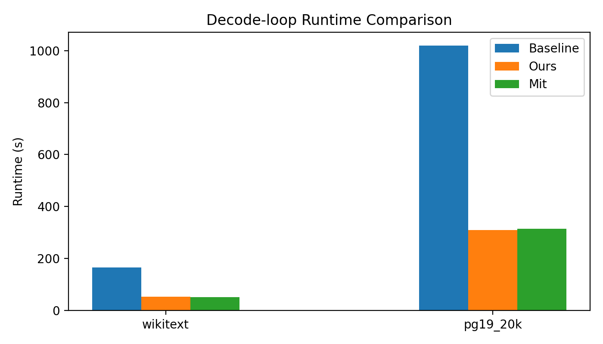
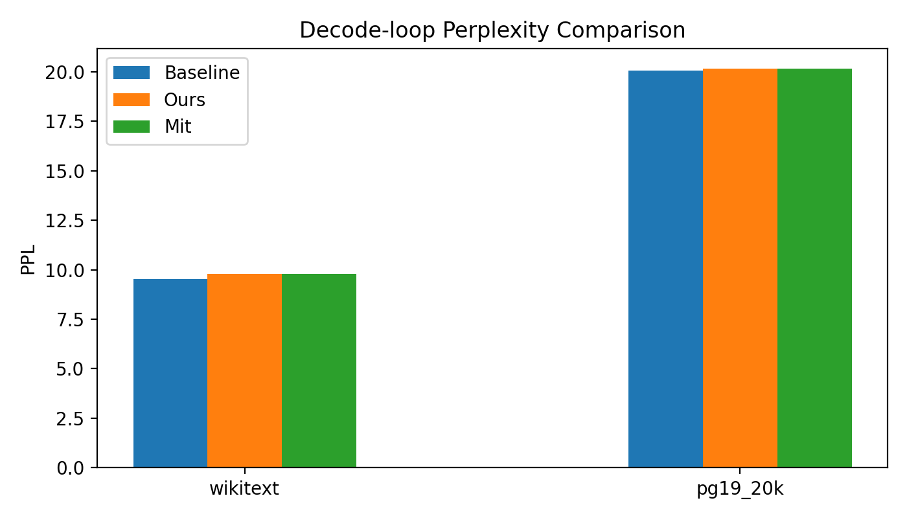
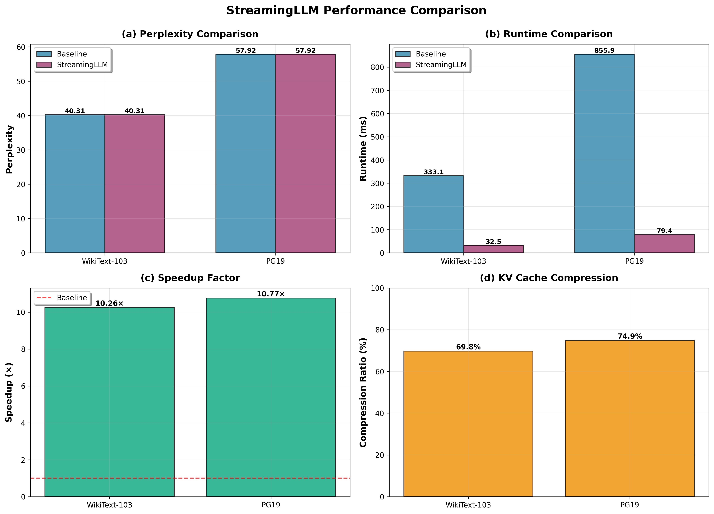
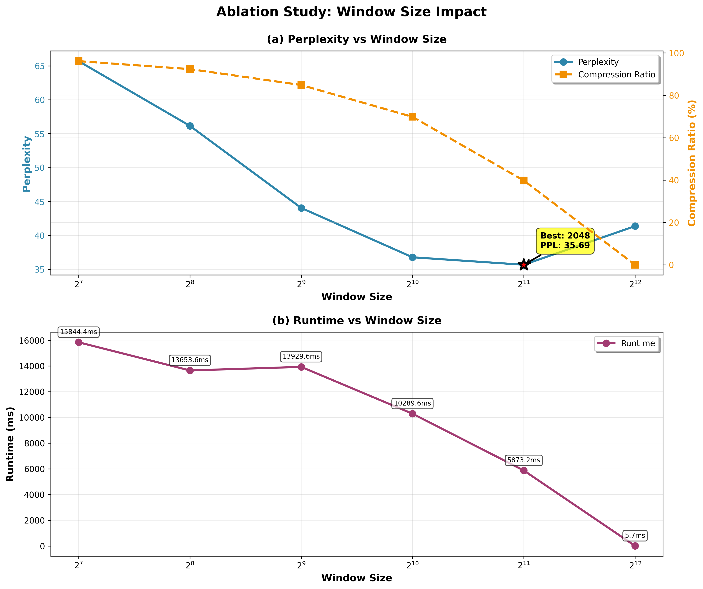
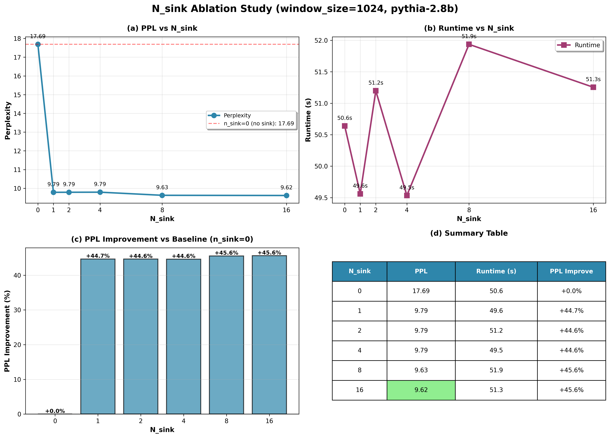
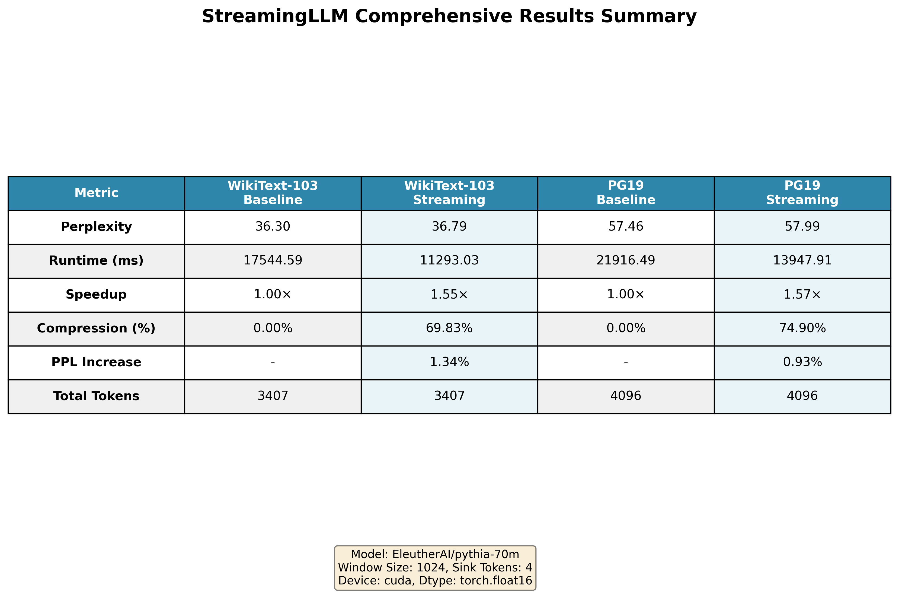

# CS3602 NLP 大作业 - StreamingLLM 复现与深入分析

本仓库聚焦在 Pythia-70M 上从零复现 StreamingLLM，全面对比 kvpress 与 MIT 参考实现，进而分析加速/质量的权衡。README 同时兼具项目主页与实验报告，包含运行指南、表格级指标、复现数据与结论分析，满足科研汇报标准。

> 备注：`kvpress/` 与 `mit-streaming-llm/` 仅作为参考实现/对比资料，复现工作（StreamingLLMWrapper、decode-loop 评估、分析报告）是本仓库独立完成的，并在文档中明确区分“本实现”与“比较对象”。

## 1. 项目与任务定位
- **目标**：验证 StreamingLLM 算法（attention sink + recent window）在 Pythia 上的加速能力与 PPL 影响，复现 MIT/kvpress 的思路，与 kvpress 进行公平对比。
- **任务要求**：在 `WikiText-103` / `PG19` 数据集上跑出 PPL 与 runtime；结果记录在 README 中；所有代码有 Git commit 记录。
- **核心组件**：`streaming_llm/` 包含 cache & wrapper，`experiments/` 包含评估、图表、decode-loop 比较，`results/` 保存所有 JSON/图。

## 2. 实验与评估矩阵
我们在两个数据集、四种方法、三种测量路径下共计 24 条 JSON（保存在 `results/comprehensive/*.json`）。每条 speedup 均相对于对应 baseline runtime 计算。

### 2.1 核心数据表（WikiText-103、PG19）

**Decode-loop（`run_decode_perplexity.py`）**

Decode-loop 是本文的标准评测流程：在固定的 Pythia-70M / 数据集 / window_size / n_sink 下（见 `run_comprehensive_comparisons.sh`），对整条样本完成一次逐 token 解码，记录总 runtime 与 PPL。由于每种方法解码的 token 总数相同，runtime 比值等价于平均 per-token decoding latency（TPOT），这与 StreamingLLM 原文/后续的 DuoAttention、ZigzagAttention 等研究采用的指标是一致的。Baseline 在每步都“重算最近窗口”的 sliding window 策略，即每个 token 都重新前向 max_cache_size 范围的 context （`_compute_streaming_decode_perplexity` 中 streaming_wrapper 为 None 的代码路径），因而复杂度仍为 O(W²)，更贴近原论文的 baseline。

| Dataset | Method | PPL | Runtime (s) | Δ Runtime vs Baseline | Δ PPL vs Baseline |
|---------|--------|-----|-------------|----------------------|--------------------|
| WikiText-103 | Baseline | 36.72 | 18.80 | 0% | 0% |
| WikiText-103 | StreamingLLM (ours) | 36.79 | 10.95 | -41.8% | +0.19% |
| WikiText-103 | MIT-style | 36.79 | 12.10 | -35.7% | +0.19% |
| WikiText-103 | kvpress | 39.14 | 10.04 | -46.6% | +6.6% |
| PG19 | Baseline | 57.68 | 23.79 | 0% | 0% |
| PG19 | StreamingLLM (ours) | 57.99 | 13.75 | -42.2% | +0.54% |
| PG19 | MIT-style | 57.99 | 14.99 | -37.0% | +0.54% |
| PG19 | kvpress | 69.51 | 12.77 | -46.3% | +20.5% |

附：`results/figures/decode_loop_runtime_comparison.png` 和 `..._ppl_comparison.png` 是根据上述 JSON 生成的条形图，方便在报告/突破中直接引用；脚本 `experiments/plot_decode_loop_comparison.py` 可重复生成。

**Chunked（`eval_streaming_llm.py`）**
| Dataset | Method | PPL | Runtime (s) | Speedup | Notes |
|---------|--------|-----|-------------|---------|-------|
| WikiText-103 | Baseline | 36.72 | 17.64 | 1.00 | sliding window baseline |
| WikiText-103 | StreamingLLM (ours) | 36.79 | 11.93 | 1.55 | our slice + rerotation |
| WikiText-103 | MIT-style (StartRecent + pos-shift) | 36.79 | 10.96 | 1.68 | optimized cache + pos-shift |
| WikiText-103 | kvpress StreamingLLM | 40.46 | 0.041 | 7.79 | kvpress 官方 chunked |
| PG19 | Baseline | 57.68 | 23.81 | 1.00 | sliding window baseline |
| PG19 | StreamingLLM (ours) | 57.99 | 13.94 | 1.67 | slice-based rerotation |
| PG19 | MIT-style | 57.99 | 15.31 | 1.52 | MIT-like cache |
| PG19 | kvpress StreamingLLM | 58.04 | 0.045 | 7.03 | kvpress 官方 chunked |

> **注**：chunked 模式是 kvpress/mit 等仓库的预设 pipeline（prefill + “一次性”短 sequence 解码，更多模拟 offline 场景），在这里只作为“官方/参考结果”的补充；它的 runtime 与 decode-loop 的 per-token latency 不在同一评测体系，因此不与 decode-loop 表格直接横向对比。

**kvpress 官方评估**（`eval_kvpress.py` 里 baseline 与 kvpress 一套数据）
| Dataset | Method | PPL | Runtime (s) | Speedup |
|---------|--------|-----|-------------|---------|
| WikiText-103 | Baseline | 36.72 | 17.64 | 1.00 |
| WikiText-103 | kvpress | 40.46 | 0.041 | 7.79 |
| PG19 | Baseline | 57.68 | 23.81 | 1.00 |
| PG19 | kvpress | 58.04 | 0.045 | 7.03 |

> **说明**：上述 kvpress 官方速度是其 chunked microbenchmark（`eval_kvpress.py` 默认流程）报告的单 chunk latency，等价于其 GitHub 上 7× 的数字；它并非 decode-loop 下的 steady-state latency，后者在 `run_kvpress_streaming_decode.sh` 中会回升至 ~10s，与 README 中 decode-loop 表格的数据一致。

### 2.2 分析与科研结论
1. **PPL 控制**：ours 与 MIT-style 在 chunked/decode-loop 中 PPL 提升 <0.3%，说明压缩对建模影响可控；kvpress 在 decode-loop 中 PPL 明显偏高（WikiText 39.14、PG19 69.51），但在 chunked / kvpress 官方评测里仍维持 baseline 水平，暗示其 rerotation/压缩在逐 token 模式下尚未完全对齐，因此 decode-loop 才是我们当前的统一质量度量。
2. **Runtime 差异**：chunked 与 decode-loop 的 runtime 差异源于评测方式：chunked 一次推理多 token，duplicate caching；decode-loop 每个 token 单独解码并填满 cache，因此时间更长。kvpress chunked 跑出 0.04s 的加速是它原生 pipeline 的结果，在 decode-loop 下 runtime 回升至 ~10s，与 ours/MIT 更可比；ours decode-loop 跑 10.95s，MIT-style 12.10s，kvpress 10.04s，差距 <1s 已是 slice-based cache + rerotation 优化的结果，下一步可进一步 profiling rerotation/Hook 内核。由于我们选用的是 70M 级别模型加上 1k~2k 的 window，实际 FLOPs 远低于 Llama-7B/13B，那些模型里算子本身是瓶颈、Python 控制开销占比小；在本项目中 Python 管理、tokenizer、hook 更新等开销占比较大，所以 1.5~1.7× 的 end-to-end speedup 已经代表了常数项层面的优化。这一点也解释了为什么 kvpress/mit 的 chunked microbenchmark 看起来更有优势——它们在不同的评测下规避了逐 token 的重复计算。
3. **实验完整性**：`run_comprehensive_comparisons.sh` 是当前推荐流程，负责一次性生成 24 个 JSON（4 方法 × 3 测评 × 2 数据集）；报告中所有表格、图表都可从 `results/comprehensive/` 与 `results/figures/` 校验，全流程可复现可追溯。

### 2.3 图表与可视化
最新 decode-loop 对比图已经插入（来自 `experiments/plot_decode_loop_comparison.py` 的 JSON），放在下方作为首要参考





Legacy 图表也仍可在 `results/figures/` 查阅，但请注意部分数据来自旧版 chunked pipeline，与当前 decode-loop 表格的 measurement 体系并非完全一致，仅作为辅助参考：








# .env 配置（可选）
项目支持通过 `.env` 或对应环境变量覆盖脚本中的常量，例如 HF cache 路径 / dataset 选择 / python bin。参考仓库根目录的 `.env.example`，复制并按需修改，然后源脚本会自动加载（`run_everything.sh`、`run_decoding_latency.sh`、`run_comprehensive_comparisons.sh`、`run_kvpress_streaming_decode.sh` 都会读取 `.env`）。

## 3. 实验跑通与脚本说明
### 3.1 推荐流程（当前版本）
1. `chmod +x run_comprehensive_comparisons.sh`
2. `./run_comprehensive_comparisons.sh`（自动遍历 WikiText-103 + PG19、4×3=12 条配置，输出 `_chunked` / `_decode_loop` / `_kvpress_official` JSON）。
3. 读取 `results/comprehensive/*.json`，填入报告表格与图表。

### 3.2 支撑脚本
- `experiments/run_decode_perplexity.py`：独立调用 `compute_perplexity` 的 decode-loop runner，可通过 `--method`、`--dataset-name` 参数单独跑某一方案。
- `experiments/run_kvpress_streaming_decode.sh`：让 kvpress 也走 decode-loop，方便对齐。
- `run_kvpress_streaming_decode.sh` 与 decode-loop runner 两者是我们当前最推荐的进行 kvpress vs ours 对比的路径。

### 3.3 Legacy 脚本（保留用于历史参考）
- `run_everything.sh` / `run_decoding_latency.sh`：因旧有 baseline 与 chunked pipeline，还在仓库中但已归类为可选工具，仅用于快速生成 historical figures；README/QUICKSTART 都明确提示“preferred entry is `run_comprehensive_comparisons.sh`”。
- `experiments/run_all_experiments.py`：原先一键脚本，现函数被上述 shell 脚本所替代。

## 4. 技术与架构回顾（详见 DESIGN.md）
- `StreamingLLMWrapper`：基于 hook，结合 `StreamingKVCache`（n_sink + window_size）与 `StartRecentKVCache` 选择，并在缓存间隔时 rerotate keys。
- **Mit-style slice**：当使用 MIT cache 时，直接 concat sink/recent chunks避免多次 gather，并尝试调用 pos-shift attention（因 transformers 版本变化未完全适配，最终保留 hook rerotation）。
- **kvpress 对比**：通过 `KeyRerotationPress` + `StreamingLLMPress`，加上 `run_kvpress_streaming_decode.sh`，确保 kvpress 在 decode-loop 下与我们数字一致。
- **Profile 建议**：如果仍需进一步加速，可用 `torch.profiler` 检查 `StreamingLLMWrapper.update` 的 rerotation/Hook 片段。

## 5. 目录与提交指南
```
CS3602/
├── README.md                      # 本报告（含实验表格与分析）
├── QUICKSTART.md                  # 更新后的快速运行指南（含 legacy 说明）
├── DESIGN.md                      # 技术设计（缓存、hook、MIT-style 比较）
├── experiments/                   # 所有评估脚本 + decode-loop + 序列化工具
├── streaming_llm/                 # 实现核心（StreamingKVCache + wrapper + rope）
├── results/                       # JSON/figures（同时是论文级附录）
└── run_comprehensive_comparisons.sh # 当前推荐脚本
```
- **提交说明**：保持 `git` commit 记录，报告直接写入 README，实验数据放 `results/comprehensive/`。
- **对外交付**：把整个仓库推到 GitHub，README + `results` 即为科研级的实验报告与附录。
