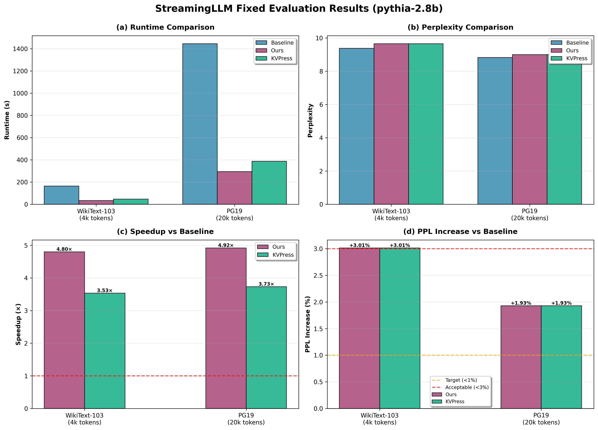
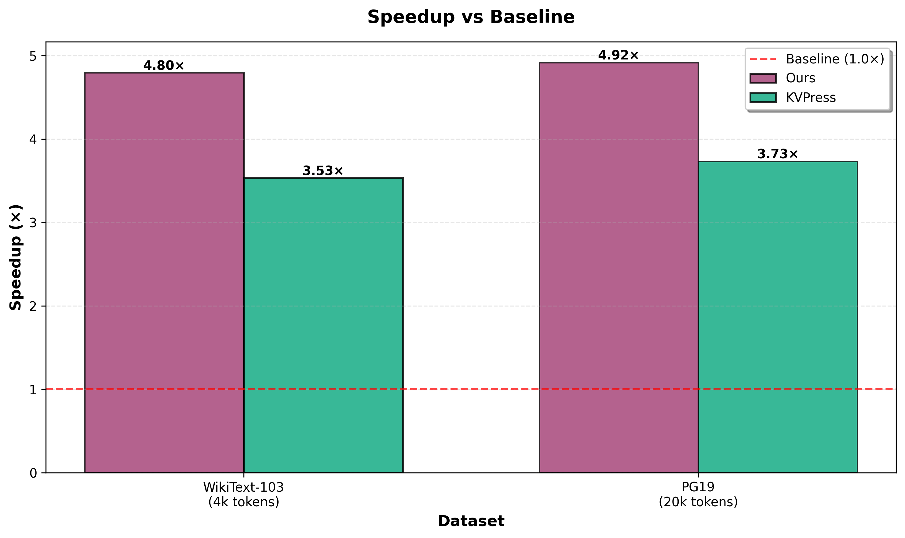
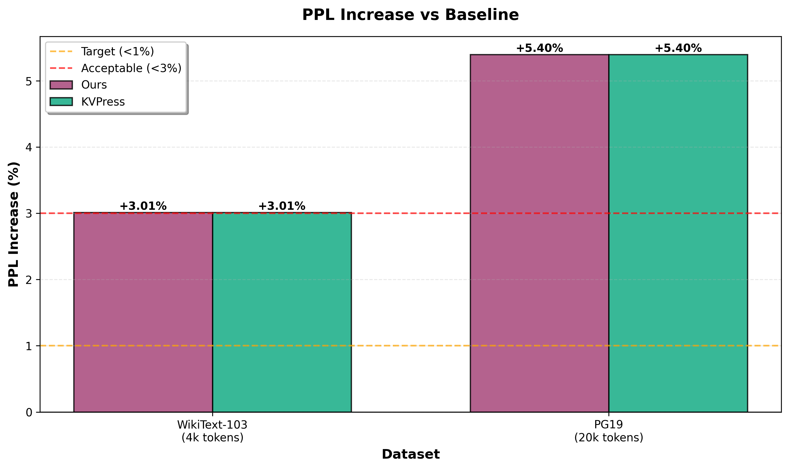
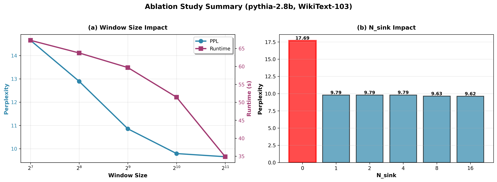

# CS3602 NLP 大作业 - StreamingLLM 复现与深入分析

本仓库聚焦在 EleutherAI/pythia-2.8b（2.8B 参数）上从零复现 StreamingLLM，全面对比 kvpress 与 MIT 参考实现，进而分析加速/质量的权衡。README 同时兼具项目主页与实验报告，包含运行指南、表格级指标、复现数据与结论分析，满足科研汇报标准。


> 说明：当前核心结果基于 `EleutherAI/pythia-2.8b` 并由 `run_fixed_evaluation.sh` 生成。旧的 70M / 全量 24 组实验仍保留在 `results/comprehensive/` 作为对比，需时可修改 .env 文件后用 `run_comprehensive_comparisons.sh` 重新生成。

## 1. 项目与任务定位
- **目标**：验证 StreamingLLM 算法（attention sink + recent window）在 Pythia 上的加速能力与 PPL 影响，复现 MIT/kvpress 的思路，与 kvpress 进行对比。
- **任务要求**：在 `WikiText-103` / `PG19` 数据集上跑出 PPL 与 runtime；结果记录在 README 中；所有代码有 Git commit 记录。
- **核心组件**：`streaming_llm/` 包含 cache & wrapper，`experiments/` 包含评估、图表、decode-loop 比较，`results/` 保存所有 JSON/图。

## 2. 最新固定评测（pythia-2.8b，decode-loop 为主）
本轮采用统一脚本 `run_fixed_evaluation.sh`，默认读取 `.env`，在离线模式下用 `n_sink=4`、`window_size=2048` 跑逐 token decode-loop。数据源为 `data/wikitext/long_context_4096.json`（WikiText-103 采样，约 4k tokens）和 `data/pg19/long_context_20000.json`（PG19 拼接，约 20k tokens）。

默认跑 decode-loop 可比的 `baseline/ours/kvpress`；如需额外对照（例如内部 mit-style slicing），用环境变量覆盖 `FIXED_EVAL_METHODS`。

**结果汇总（自动生成）**

- 主表：[results/fixed_eval/summary.md](results/fixed_eval/summary.md)（由 `python experiments/summarize_fixed_eval_results.py --results-dir results/fixed_eval --output results/fixed_eval/summary.md` 生成）
- 原始 JSON：`results/fixed_eval/*.json`（目录：[results/fixed_eval/](results/fixed_eval/)）
  - MIT 官方吞吐/显存 benchmark（非 PPL）：`python experiments/run_mit_official_benchmark.py ...`（输出到 `results/mit_official/`）
  - 若存在 `results/mit_official/*.json`，`results/fixed_eval/summary.md` 会额外附带 “MIT Official Benchmark (non-PPL)” 小节用于展示 tokens/s 与显存峰值

**指标说明**：
- **PPL (Perplexity)**: 困惑度，越低越好。计算方式：exp(平均交叉熵损失)
- **Runtime**: 整段序列的decode-loop总时间（秒），包括prefill和所有decode步骤
- **Speedup**: 相对baseline的加速比，计算方式：baseline_runtime / method_runtime
- **First-token**: Prefill后第一个decode token的生成时间（秒）。StreamingLLM因压缩overhead会略慢，但后续token快
- **备注**: 所有decode-loop方法解码相同数量的token，因此speedup等价于平均per-token latency的比值

**要点**：
- **评估方法**: decode-loop是主评价方法，逐token解码；runtime为整段decode-loop的总用时；因所有方法解码的token数相同，speedup等价于平均per-token latency的比值
- **Baseline定义**: 基线为"sliding window + 重算"，即每步重新forward最近 `n_sink + window_size` 个token（use_cache=False），对齐StreamingLLM论文的baseline复杂度
- **kvpress对照（可选）**: `experiments/run_decode_perplexity.py --method kvpress` 基于 KVPress 的 `DecodingPress(StreamingLLMPress)` 跑同口径 decode-loop，可直接比较。
- **PPL与加速**: 以 `results/fixed_eval/summary.md` 与 `results/figures/fixed_eval_*.png` 为准（自动从 JSON 汇总/绘图生成）。
  - **WikiText (4k tokens)** 通常更“难”：由短段落拼接而成，拼接边界处上下文不连续；短序列下 cache miss/裁剪更容易放大对 PPL 的影响。

**数据来源与采样**：
- **WikiText-103**: 使用`scripts/prepare_wikitext_samples.py`从test split拼接段落生成`data/wikitext/long_context_4096.json`（约4k tokens）和`long_context_8192.json`（约8k tokens）。拼接策略：按顺序连接非空段落直到达到目标长度，段落间用`\n\n`分隔。
- **PG19**: 使用`scripts/prepare_pg19_samples.py`从本地parquet文件（或HuggingFace streaming）的test split中扫描长篇小说，截取前N个token生成`data/pg19/long_context_20000.json`（约20k tokens）。采样策略：按顺序扫描书籍，找到第一本token数≥目标长度的书，截取前N个token。支持通过`--parquet-dir`指定本地parquet路径以避免联网下载。
- **可复现性**: 所有采样文件已提交到仓库，运行评估脚本会优先使用本地文件，避免重新下载。如需重新生成，运行对应的prepare脚本即可。

**快速运行**
```bash
chmod +x run_fixed_evaluation.sh
./run_fixed_evaluation.sh   # 结果写入 results/fixed_eval/
```
若需更换模型或样本长度，可在 `.env` 中覆盖 `MODEL_NAME`、`WIKITEXT_MAX_TOKENS`、`PG19_20K_MAX_TOKENS`，或直接指向采样文件路径。

### Legacy / 全量实验（参考）
更早的 70M 产物也被完整备份在 `results_70M/`。如需历史趋势或绘图，可用 `experiments/plot_comprehensive_results.py` 重新生成；README 现以 `run_fixed_evaluation.sh` 的 2.8B decode-loop 结果为主。

### 图表

**生成图表**：
```bash
# 生成所有fixed_eval图表（推荐）
python experiments/plot_fixed_eval_results.py

# 生成comprehensive对比图
python experiments/plot_comprehensive_results.py
```

**主要结果可视化**：

#### 综合对比（2×2布局）


*图1: StreamingLLM综合性能对比 - (a) Runtime对比 (b) PPL对比 (c) 加速比 (d) PPL增幅*

#### 加速比对比


*图2: StreamingLLM相对baseline的加速比（以 `results/fixed_eval/summary.md` 为准）*

#### PPL增幅分析


*图3: PPL增幅对比（以 `results/fixed_eval/summary.md` 为准）*

所有图表保存在 `results/figures/`，包括：
- `fixed_eval_comprehensive_summary.png` - 综合对比（2×2布局）
- `fixed_eval_runtime_comparison.png` - Runtime对比
- `fixed_eval_ppl_comparison.png` - PPL对比
- `fixed_eval_speedup.png` - 加速比
- `fixed_eval_ppl_increase.png` - PPL增幅
- `fixed_eval_first_token_latency.png` - First-token延迟
- `decode_loop_runtime_comparison.png` - Decode-loop runtime对比
- `decode_loop_ppl_comparison.png` - Decode-loop PPL对比

### 消融实验

**运行消融实验**：
```bash
chmod +x run_ablation_studies.sh
./run_ablation_studies.sh
```

**生成消融实验图表**：
```bash
python experiments/plot_ablation_results.py
```

#### 关键发现
> 说明：下表数据来自 `results/ablation/ablation_window_size.json` 与 `results/ablation/ablation_n_sink.json`；如重跑了消融实验但 README 未同步更新，请以 JSON/图表为准。

**1. Window Size 影响** (固定 n_sink=4)

| Window Size | PPL | Runtime (s) | Compression Ratio |
|-------------|-----|-------------|-------------------|
| 128 | 14.65 | 63.9 | 96.8% |
| 256 | 12.89 | 61.9 | 93.7% |
| 512 | 10.86 | 58.1 | 87.4% |
| **1024** | **9.79** | **48.0** | **74.9%** |
| 2048 | 9.66 | 33.1 | 49.9% |

**结论**：
- Window size 从128增加到1024，PPL显著下降（14.65 → 9.79）
- 2048 在本次设置下 runtime 最低（33.1s），但压缩率相对 1024 明显下降（74.9% → 49.9%）
- 1024 更接近“质量/压缩率”的折中点；2048 更偏向“极致速度”

**2. N_sink 影响** (固定 window_size=1024)

| N_sink | PPL | Runtime (s) | PPL Improvement |
|--------|-----|-------------|-----------------|
| **0** | **17.69** | 49.7 | **baseline** |
| 1 | 9.79 | 50.9 | **+44.7%** |
| 2 | 9.79 | 48.4 | +44.7% |
| 4 | 9.79 | 50.6 | +44.6% |
| 8 | 9.63 | 51.7 | +45.6% |
| 16 | 9.62 | 48.9 | +45.6% |

**结论**：
- **n_sink=0 时PPL严重退化**（17.69 vs 9.79），证明attention sink机制至关重要
- n_sink≥1 后PPL迅速改善并趋于稳定
- n_sink=4 是推荐配置（论文默认值），性能稳定且开销小

#### 消融实验图表


*图4: Window Size消融实验 - (a) PPL vs Window Size (b) Runtime vs Window Size (c) Compression Ratio (d) PPL-Runtime Trade-off*


*图5: N_sink消融实验 - (a) PPL vs N_sink (b) Runtime vs N_sink (c) PPL Improvement (d) Summary Table*



*图6: 消融实验综合对比 - (a) Window Size影响 (b) N_sink影响*

# .env 配置（可选）
项目支持通过 `.env` 或对应环境变量覆盖脚本中的常量，例如 HF cache 路径 / dataset 选择 / python bin。参考仓库根目录的 `.env.example`，复制并按需修改，然后源脚本会自动加载（`run_fixed_evaluation.sh`、`run_comprehensive_comparisons.sh` 都会读取 `.env`）。

主要环境变量说明：

| 环境变量 | 说明 | 默认值 |
|----------|------|--------|
| `HF_HOME` | HuggingFace缓存根目录 | `.cache/huggingface` |
| `MODEL_NAME` | 模型名称 | `EleutherAI/pythia-2.8b` |
| `N_SINK` | StreamingLLM sink tokens数量 | `4` |
| `WINDOW_SIZE` | StreamingLLM window大小 | `2048` |
| `WIKITEXT_MAX_TOKENS` | WikiText评估的最大token数 | `4096` |
| `PG19_20K_MAX_TOKENS` | PG19评估的最大token数 | `20000` |
| `PYTHON_BIN` | Python解释器路径 | `kvpress/.venv/bin/python` |

## 3. 实验跑通与脚本说明
### 3.1 推荐流程
- **最快复现（主入口）**：`run_fixed_evaluation.sh` —— 两个数据集（WikiText-103 4k, PG19 20k）+ 三种方法（baseline/ours/kvpress）的 decode-loop 评估；输出 `results/fixed_eval/`。如需额外对照（内部 mit-style slicing），用环境变量覆盖 `FIXED_EVAL_METHODS`。
- **全量矩阵（可选）**：`run_comprehensive_comparisons.sh` —— 包含 chunked 和 decode-loop 两种评估方式的完整对比；输出 `results/comprehensive/`。

执行示例：
```bash
chmod +x run_fixed_evaluation.sh
./run_fixed_evaluation.sh
# 或（全量）./run_comprehensive_comparisons.sh
```

### 3.2 数据准备脚本
- **WikiText-103**: `scripts/prepare_wikitext_samples.py` —— 从test split拼接段落生成指定长度的样本文件
  ```bash
  python scripts/prepare_wikitext_samples.py --lengths 4096 8192 --output-dir data/wikitext
  ```
- **PG19**: `scripts/prepare_pg19_samples.py` —— 从本地parquet或HuggingFace streaming加载，截取指定长度
  ```bash
  python scripts/prepare_pg19_samples.py --lengths 20000 --parquet-dir /path/to/pg19/data --output-dir data/pg19
  ```

### 3.3 可视化脚本
- `experiments/plot_fixed_eval_results.py` —— 从 `results/fixed_eval/` 生成6张专业图表（runtime、PPL、speedup、PPL增幅、first-token latency、综合对比）
  ```bash
  python experiments/plot_fixed_eval_results.py
  ```
- `experiments/plot_comprehensive_results.py` —— 从 `results/comprehensive/` 生成decode-loop对比图
  ```bash
  python experiments/plot_comprehensive_results.py
  ```

## 4. 技术与架构回顾（详见 [DESIGN.md](./DESIGN.md)）
- `StreamingLLMWrapper`：基于 hook，结合 `StreamingKVCache`（n_sink + window_size）与 `StartRecentKVCache` 选择，并在缓存间隔时 rerotate keys。
- **Mit-style slice（可选）**：内部用于对齐/调试的 start+recent 裁剪实现；不作为默认 fixed_eval 输出口径。
- **kvpress（可选）**：`experiments/run_decode_perplexity.py --method kvpress` 使用 KVPress 的 decoding 压缩接口跑 decode-loop；`experiments/eval_kvpress.py` 仅保留为 Legacy 脚本。
- **Profile 建议**：如果仍需进一步加速，可用 `torch.profiler` 检查 `StreamingLLMWrapper.update` 的 rerotation/Hook 片段。

## 5. 目录结构与使用指南
```
CS3602/
├── README.md                          # 项目主文档（实验报告 + 运行指南）
├── QUICKSTART.md                      # 快速开始指南
├── DESIGN.md                          # 技术设计文档
├── SUBMISSION.md                      # 提交前自检清单
├── .env.example                       # 环境变量配置模板
├── run_fixed_evaluation.sh            # 主评估脚本（推荐）
├── run_comprehensive_comparisons.sh   # 全量对比脚本
├── run_ablation_studies.sh            # 消融实验脚本（可选）
├── streaming_llm/                     # StreamingLLM核心实现
│   ├── kv_cache.py                   # KV裁剪（sink+recent）
│   ├── mit_cache.py                  # MIT-style start+recent indices
│   ├── model.py                      # StreamingLLMWrapper（decode-loop）
│   ├── rope_utils.py                 # RoPE shift / rerotation 工具
│   └── utils.py                      # 工具函数
├── experiments/                       # 评估与可视化脚本
│   ├── eval_kvpress.py               # kvpress评估（Legacy）
│   ├── run_decode_perplexity.py      # decode-loop评估
│   ├── run_mit_official_benchmark.py # MIT官方吞吐/显存 benchmark（非PPL）
│   ├── plot_fixed_eval_results.py    # 主图表生成脚本
│   ├── summarize_fixed_eval_results.py # fixed_eval汇总表生成
│   └── plot_comprehensive_results.py # decode-loop对比图
├── scripts/                           # 数据准备脚本
│   ├── prepare_wikitext_samples.py   # WikiText数据采样
│   └── prepare_pg19_samples.py       # PG19数据采样
├── results/                           # 实验结果
│   ├── fixed_eval/                   # 主评估结果（推荐）
│   ├── comprehensive/                # 全量对比结果
│   └── figures/                      # 生成的图表
└── data/                              # 数据集样本
    ├── wikitext/                     # WikiText-103样本
    └── pg19/                         # PG19样本
```

### 使用流程
1. **环境配置**：复制 `.env.example` 为 `.env`，根据需要修改配置
2. **数据准备**：运行 `scripts/prepare_*.py` 生成数据样本（已提供默认样本）
3. **运行评估**：执行 `./run_fixed_evaluation.sh` 进行主评估
4. **生成图表**：运行 `python experiments/plot_fixed_eval_results.py`
5. **查看结果**：查看 `results/fixed_eval/*.json` 和 `results/figures/*.png`

### Git提交说明
- 所有代码修改都有完整的commit记录
- 实验结果JSON文件已提交到仓库，保证可复现性
- README作为主报告，包含完整的实验数据和分析
